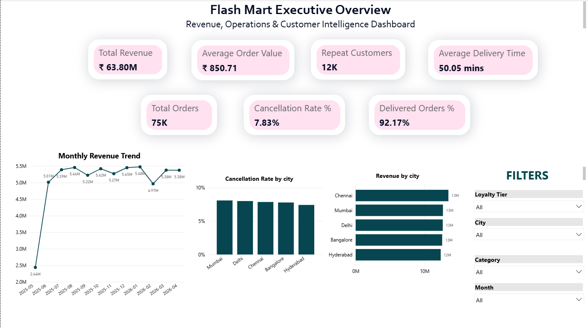

# FlashMart Operations Intelligence Dashboard

## Project Overview

FlashMart is a multi-city quick-commerce analytics platform designed to monitor revenue, delivery efficiency, customer behavior, and operational performance using Power BI, MySQL, SQL, and Python.

The project simulates real-world business operations across multiple cities and provides executive-level insights through interactive dashboards and KPI tracking.

---

## Tech Stack

- Power BI
- MySQL
- SQL
- Python
- Pandas
- DAX

---

## Business KPIs

- Total Revenue
- Total Orders
- Average Order Value
- Cancellation Rate
- Delivered Orders %
- Repeat Customers
- Average Delivery Time

---

## Dashboard Features

- Executive Overview Dashboard
- Revenue Trend Analysis
- City-Level Revenue Comparison
- Operational KPI Monitoring
- Interactive Filters & Slicers

---

## SQL Analytics

The project includes:
- KPI queries
- city-level analysis
- customer analytics
- inventory analysis
- advanced SQL window functions

---

## Synthetic Data Generation

Custom Python scripts were used to simulate:
- 75K+ orders
- 12K customers
- multi-city operations
- inventory systems
- operational metrics

---

## Dashboard Preview

